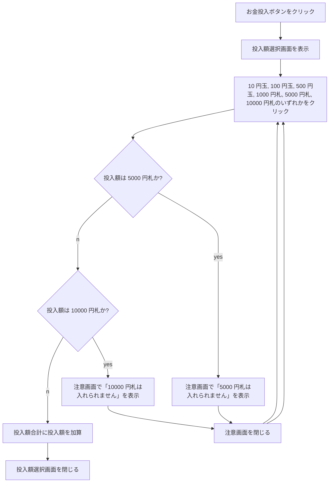

# 課題 2-1

自動販売機を模したアプリケーションのうち、投入額合計に応じた選択可能な商品の強調処理を作成する。

## 画面仕様

### 画面一覧

| 画面 ID        | 画面名称       | 機能概要                                                       |
| -------------- | -------------- | -------------------------------------------------------------- |
| VENDOR-01      | 自動販売機画面 | お金投入、投入額に応じた購入可能商品の協調、商品購入が行なえる |
| VENDOR-MSG-01  | 投入額選択画面 | お金投入時に表示され投入するお金を選択する                     |
| GENERAL-MSG-01 | 情報画面       | 入力された文字列を表示し、確認ボタンで閉じる                   |
| GENERAL-MSG-02 | 注意画面       | 入力された文字列を表示し、確認ボタンで閉じる                   |
| GENERAL-MSG-03 | エラー画面     | 入力された文字列を表示し、確認ボタンで閉じる                   |

### 自動販売機画面

| 名称         | 形式   | 備考                                                                             |
| ------------ | ------ | -------------------------------------------------------------------------------- |
| 商品名称     | 文字列 | 投入額合計が対応する金額以上の場合は背景色を`#FFD966`、文字色を`#FF190C`とする。 |
| 金額         | 数値   |                                                                                  |
| 金額単位     | 文字列 |                                                                                  |
| 選択可否表示 | 文字列 | 投入額合計が対応する金額以上の場合は`ON`を表示、それ以外は`OFF`を表示する。      |
| 投入額合計   | 数値   |                                                                                  |
| お金投入     | ボタン | クリックで投入額選択画面を表示する。                                             |

### 投入額選択画面

| 名称                         | 形式               | 備考                                   |
| ---------------------------- | ------------------ | -------------------------------------- |
| 投入額選択メッセージボックス | メッセージボックス | 共有された情報にはない為こちらで検討。 |
| 10 円玉                      | ボタン             | 共有された情報にはない為こちらで検討。 |
| 100 円玉                     | ボタン             | 共有された情報にはない為こちらで検討。 |
| 500 円玉                     | ボタン             | 共有された情報にはない為こちらで検討。 |
| 1000 円札                    | ボタン             | 共有された情報にはない為こちらで検討。 |
| 5000 円札                    | ボタン             | 共有された情報にはない為こちらで検討。 |
| 10000 円札                   | ボタン             | 共有された情報にはない為こちらで検討。 |

## 動作仕様

### お金投入処理

